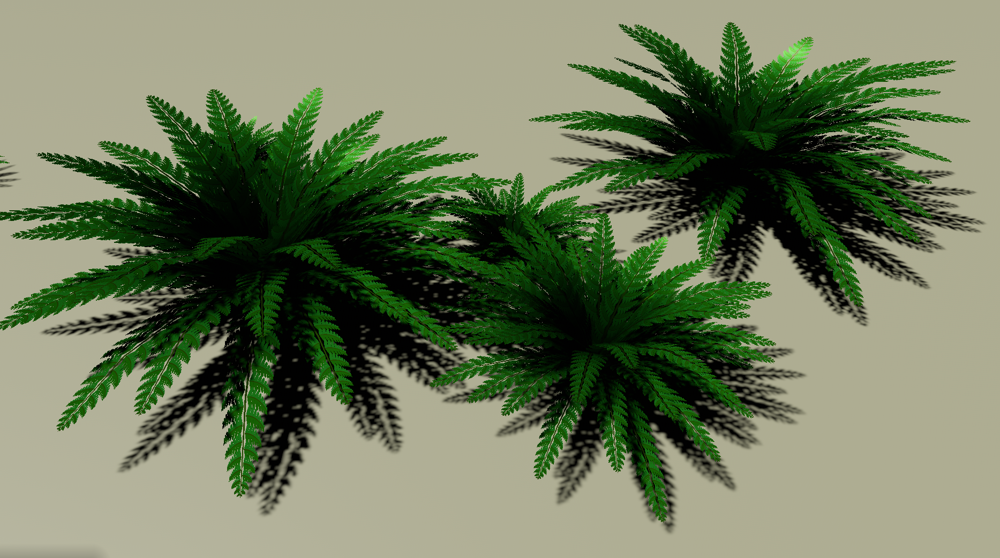

# Bevy Procedural: Vegetation

  
  
  
   

The objective of the [Bevy Procedural Project](https://bevy-procedural.org) is to furnish a comprehensive suite of packages for the generation of procedural graphics, unified by a consistent API.

[Procedural Vegetation](https://bevy-procedural.org/begetation) is concerned with generating procedural vegetation in 3d and 2d using realistic as well as more stylized approaches.

Run the editor example using `cargo watch -w editor/src -w src -x "run -p editor --profile fast-dev"`.

## WARNING

This repository is a very early work in progress and is not yet ready for use.

The Bevy Procedural ecosystem is presently in its nascent phase. Expect frequent API modifications as it is under active development, with many features yet to be implemented. We highly encourage contributions to enrich the project!

## License

The bevy-procedural packages are free, open source and permissively licensed. Except where noted (below and/or in individual files), all code in these repositories is dual-licensed, allowing you the flexibility to choose between:

 - The MIT License (LICENSE-MIT or http://opensource.org/licenses/MIT)
 - The Apache License, Version 2.0 (LICENSE-APACHE or http://www.apache.org/licenses/LICENSE-2.0).